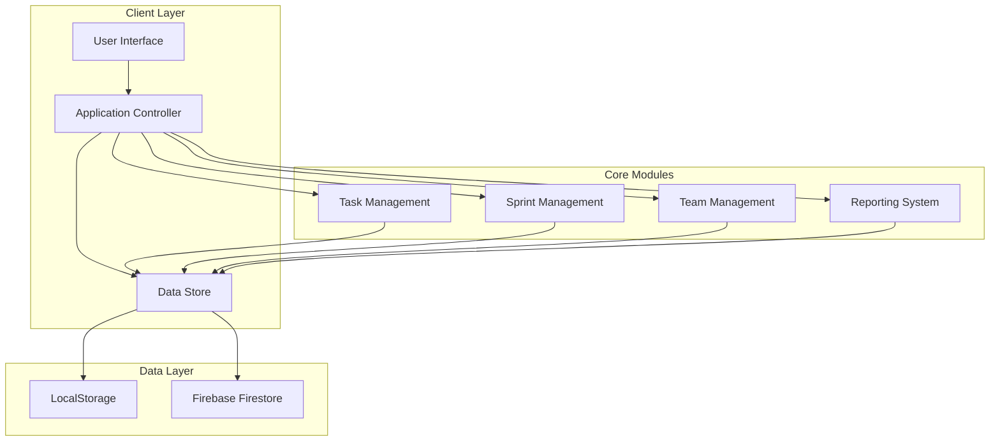
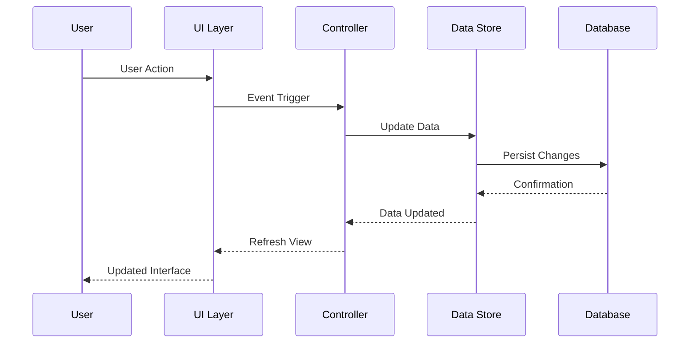
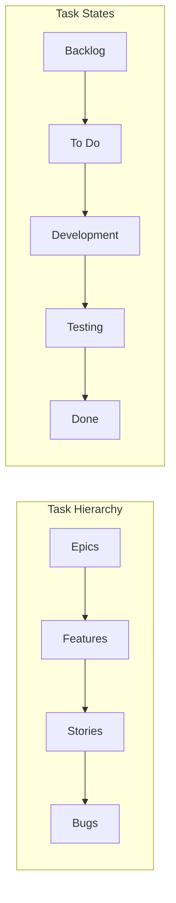
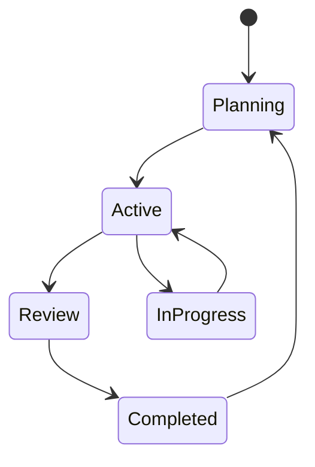
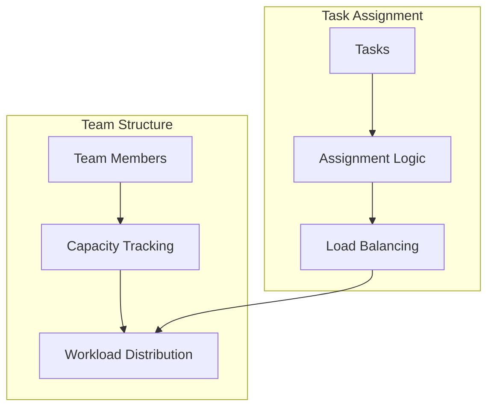
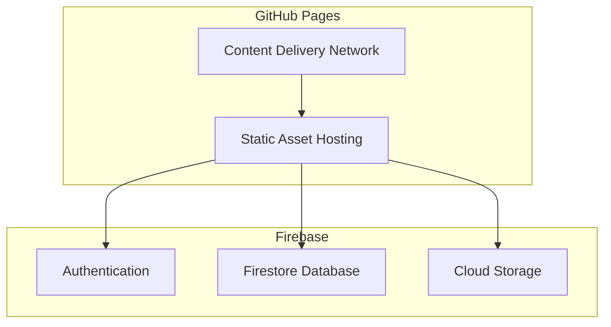

# Agile Backlog Manager Pro - Architecture Documentation

## Overview

Agile Backlog Manager Pro is a modern, single-page application (SPA) for agile project management. It provides comprehensive sprint planning, task tracking, and team management capabilities with a responsive, intuitive interface.

## Technology Stack

### Frontend
- **HTML5** - Semantic markup and structure
- **Tailwind CSS** - Utility-first CSS framework for styling
- **Feather Icons** - Lightweight icon library
- **Vanilla JavaScript (ES6+)** - Core application logic

### Data Persistence
- **LocalStorage** - Client-side data storage (demo mode)
- **Firebase** - Cloud database (production ready - configuration required)

### Browser Compatibility
- Chrome 90+
- Firefox 88+
- Safari 14+
- Edge 90+

## System Architecture



## Data Flow Architecture



## Component Architecture

### Core Components

#### 1. Task Management System


#### 2. Sprint Management System


#### 3. Team & Capacity Management


## Data Models

### Task Model
```javascript
{
  id: string,           // Unique identifier (e.g., "EPIC-101")
  type: string,         // 'epic' | 'feature' | 'story' | 'bug'
  title: string,        // Task title
  description: string,  // Detailed description
  status: string,       // 'backlog' | 'todo' | 'dev' | 'testing' | 'done'
  points: number,       // Story points (0, 1, 2, 3, 5, 8, 13)
  priority: string,     // 'low' | 'medium' | 'high' | 'critical'
  assignee: string,     // Team member ID
  parentId: string,     // Parent task ID for hierarchy
  sprint: number,       // Sprint number
  createdAt: Date,
  updatedAt: Date
}
```

### Team Member Model
```javascript
{
  id: string,           // Unique identifier
  name: string,         // Member name
  initial: string,      // Initial for avatar
  color: string,        // Avatar color class
  capacity: number      // Sprint capacity in points
}
```

### Sprint Configuration Model
```javascript
{
  number: number,       // Current sprint number
  days: number,         // Sprint duration in days
  current: number       // Current day in sprint
}
```

### Sprint History Model
```javascript
{
  number: number,       // Sprint number
  items: Array<Task>,   // Completed tasks
  points: number,       // Total points completed
  retroGood: string,    // Retrospective - what went well
  retroImprove: string, // Retrospective - improvements needed
  completedAt: Date
}
```

## Key Algorithms

### Points Calculation (Rollup)
```javascript
function getEffectivePoints(task) {
  if (!task) return 0;
  
  // Leaf nodes (stories, bugs) use their own points
  if (task.type === 'story' || task.type === 'bug') {
    return parseInt(task.points) || 0;
  }
  
  // Parent nodes (epics, features) sum up children
  const children = tasks.filter(t => t.parentId === task.id);
  return children.reduce((sum, child) => sum + getEffectivePoints(child), 0);
}
```

### Capacity Utilization
```javascript
function calculateTeamUtilization() {
  return team.map(member => {
    const assignedPoints = tasks
      .filter(t => t.assignee === member.id && t.status !== 'backlog')
      .filter(t => t.type === 'story' || t.type === 'bug')
      .reduce((sum, task) => sum + getEffectivePoints(task), 0);
    
    return {
      member,
      assignedPoints,
      capacity: member.capacity,
      utilization: (assignedPoints / member.capacity) * 100
    };
  });
}
```

## Security Considerations

### Client-Side Security
- Input validation and sanitization
- XSS prevention through proper data handling
- Secure data storage in localStorage

### Production Security (Firebase Integration)
- Firebase Security Rules for data access
- User authentication implementation
- Data encryption in transit
- Environment-based configuration

## Performance Optimizations

### Rendering Optimization
- Virtual scrolling for large task lists
- Debounced view updates
- Efficient DOM manipulation
- Lazy loading of components

### Data Management
- Optimized data structures for quick lookups
- Efficient filtering and sorting algorithms
- Minimal re-renders through strategic state management
- Local caching for frequently accessed data

## Scalability Considerations

### Current Limitations
- Single-user localStorage implementation
- No real-time collaboration
- Limited to client-side processing

### Scaling Solutions
- Firebase integration for multi-user support
- Real-time data synchronization
- Server-side processing for heavy operations
- Microservices architecture for enterprise scaling

## Deployment Architecture

### Development Environment


### Production Deployment


## Monitoring & Analytics

### Client-Side Monitoring
- Error tracking and logging
- Performance metrics collection
- User interaction analytics
- Feature usage statistics

### Production Monitoring
- Application performance monitoring (APM)
- Database performance metrics
- User behavior analytics
- System health monitoring

## Future Enhancements

### Planned Features
- Real-time collaboration
- Advanced reporting and analytics
- Integration with external tools (Jira, GitHub, etc.)
- Mobile application development
- Advanced workflow customization

### Technical Improvements
- Progressive Web App (PWA) capabilities
- Offline functionality
- Advanced security features
- Performance optimizations
- Accessibility improvements

---

## Development Guidelines

### Code Organization
- Modular JavaScript architecture
- Separation of concerns
- Consistent naming conventions
- Comprehensive documentation

### Testing Strategy
- Unit tests for core functions
- Integration tests for user workflows
- End-to-end testing for critical paths
- Performance testing for scalability

### Version Control
- Semantic versioning
- Feature branch workflow
- Comprehensive commit messages
- Regular code reviews

This architecture documentation provides a comprehensive overview of the Agile Backlog Manager Pro system, enabling developers to understand, maintain, and extend the application effectively.
