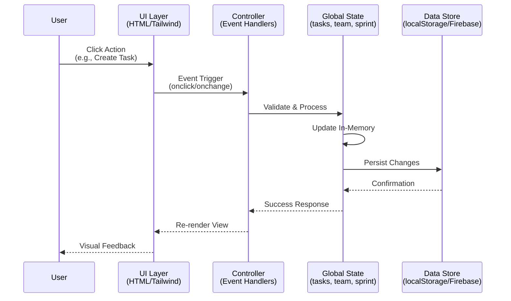
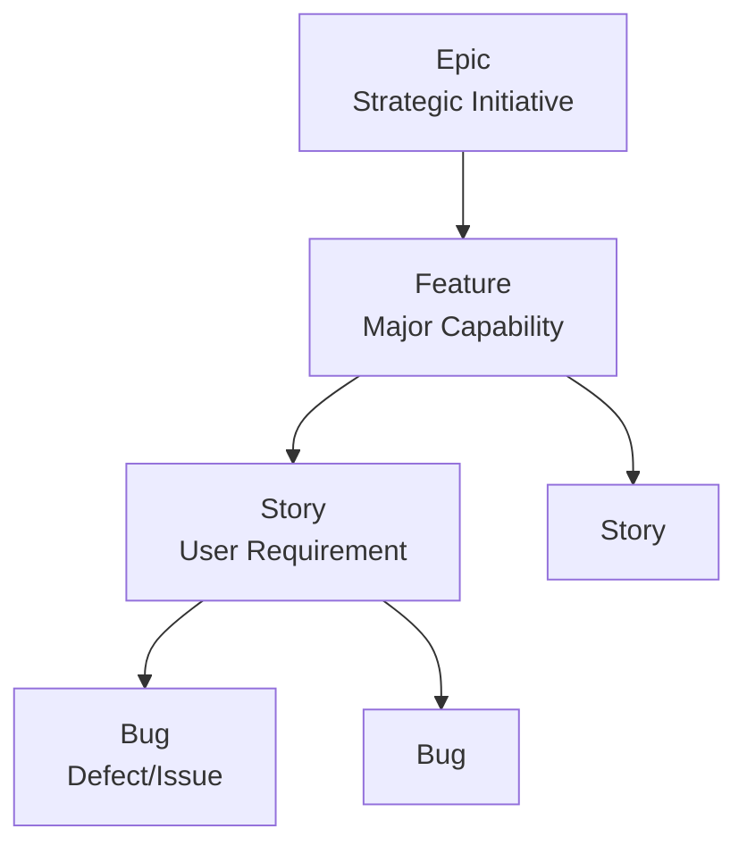
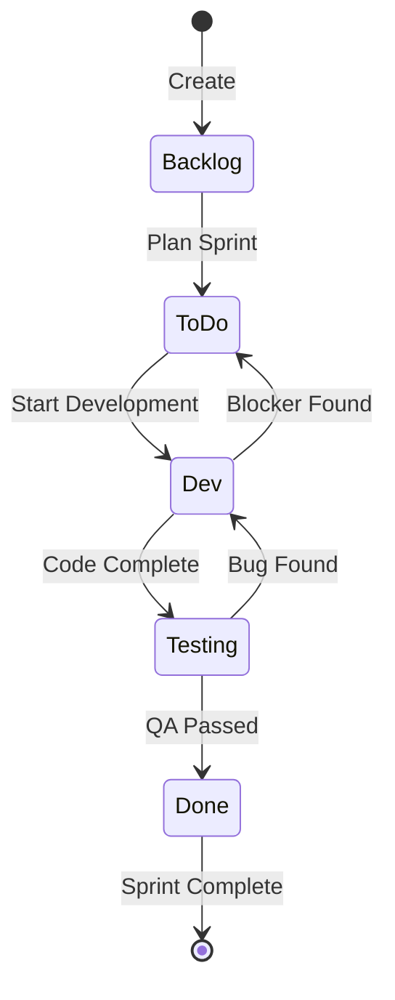
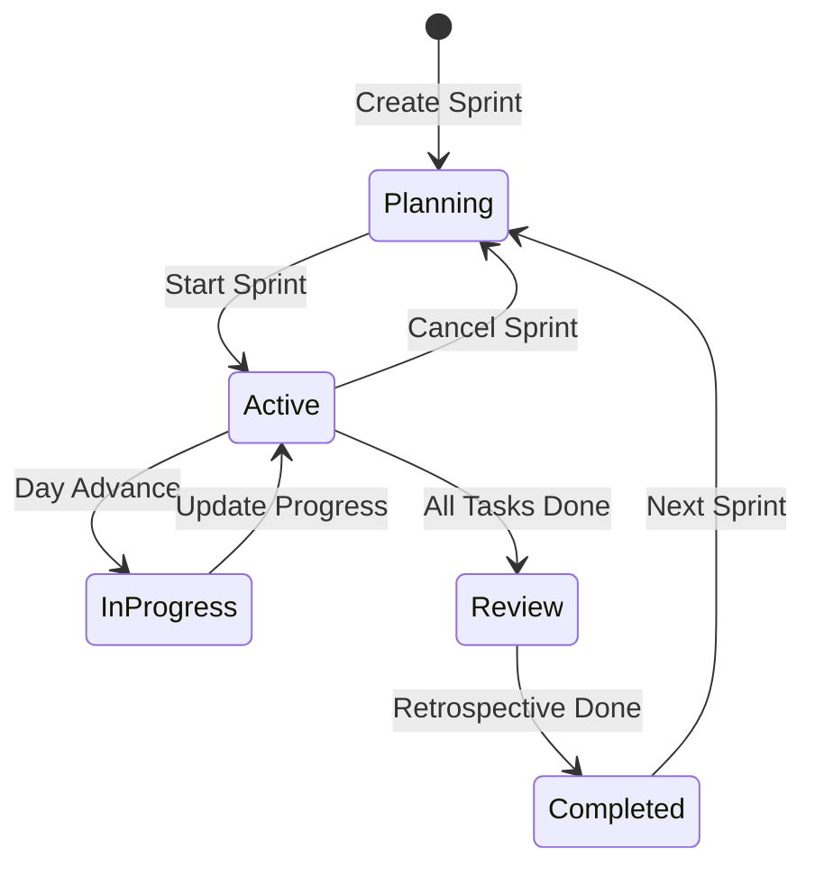
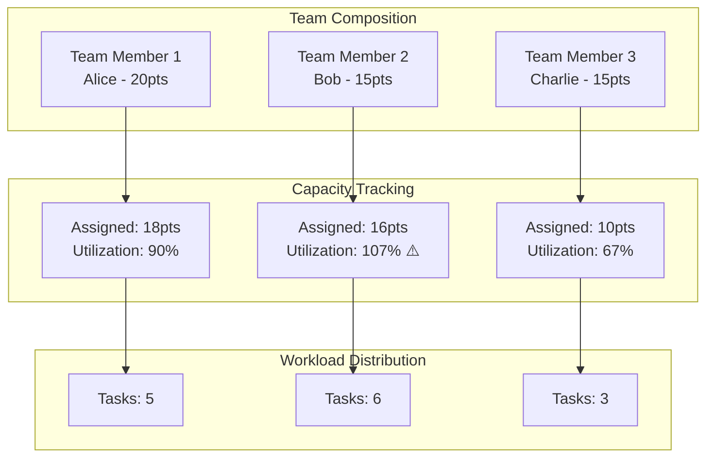
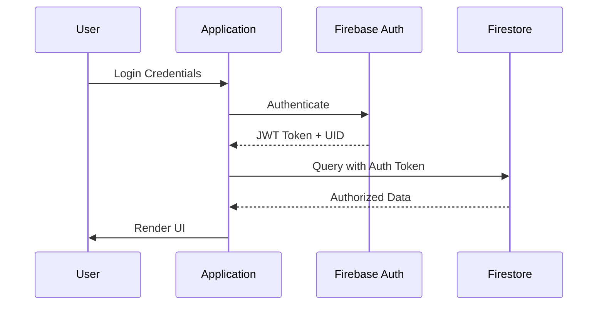
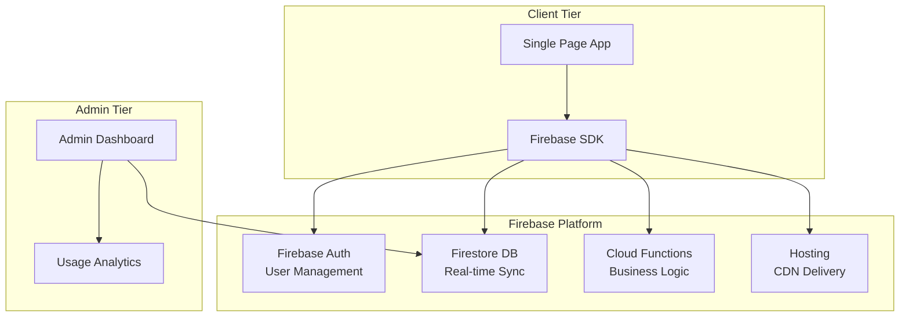
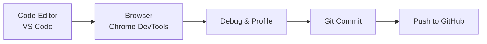

# Agile Backlog Manager Pro - Complete Architecture Documentation

## 🎯 Overview

Agile Backlog Manager Pro is a professional-grade, browser-based single-page application (SPA) designed for agile project management. Built entirely with vanilla JavaScript and modern web technologies, it provides comprehensive sprint planning, task tracking, team capacity management, and analytics without requiring any server-side infrastructure.

**Key Capabilities:**
- Hierarchical task management (Epics → Features → Stories → Bugs)
- Smart points rollup with automatic parent-level calculations
- Full sprint lifecycle management (planning, execution, completion, retrospectives)
- Real-time team capacity tracking and workload balancing
- Multiple views: Backlog, Kanban Board, Roadmap, Burndown Analytics
- Advanced search and filtering capabilities
- Sprint history and velocity tracking
- Email report generation and dispatch

---

## 🏗️ Technology Stack

### Frontend
- **HTML5** - Semantic markup and structure
- **Tailwind CSS v3.x** - Utility-first CSS framework (loaded via CDN)
- **Feather Icons** - Lightweight, responsive icon library (v1.0.22)
- **Vanilla JavaScript (ES6+)** - Core application logic with zero dependencies
- **Google Fonts** - Inter font family for modern typography

### Data Persistence
- **LocalStorage API** - Client-side data storage (demo/standalone mode)
  - Keys: `agile_v50_tasks`, `agile_v50_team`, `agile_v50_sprint`, `agile_v50_history`
  - Capacity: ~5-10MB depending on browser
- **Firebase Firestore** (Optional - production ready)
  - Real-time cloud database
  - Multi-user synchronization
  - Requires manual configuration in `index.html`

### External CDN Dependencies
```html
<script src="https://cdn.tailwindcss.com"></script>
<script src="https://unpkg.com/feather-icons"></script>
<link href="https://fonts.googleapis.com/css2?family=Inter:wght@300;400;500;600;700;800;900&display=swap" rel="stylesheet">
```

### Browser Compatibility
- **Chrome 90+** (Recommended)
- **Firefox 88+**
- **Safari 14+**
- **Edge 90+**
- Mobile browsers with modern JavaScript support

## System Architecture

### High-Level Architecture Diagram

```mermaid
graph TB
    subgraph "Presentation Layer"
        UI[User Interface - HTML/Tailwind]
        VIEWS[View Components: Backlog/Kanban/Roadmap]
        MODALS[Modal Dialogs & Forms]
    end
    
    subgraph "Application Layer"
        CTRL[Application Controller]
        STATE[Global State Management]
        EVENTS[Event Handling System]
    end
    
    subgraph "Business Logic Layer"
        TASK[Task Management Module]
        SPRINT[Sprint Management Module]
        TEAM[Team & Capacity Module]
        REPORT[Reporting & Analytics Module]
        SEARCH[Search & Filter Module]
    end
    
    subgraph "Data Access Layer"
        STORE[Data Store Interface]
        LOCAL[LocalStorage Adapter]
        FIREBASE[Firebase Adapter (Optional)]
    end
    
    UI --> VIEWS
    VIEWS --> CTRL
    CTRL --> STATE
    CTRL --> EVENTS
    EVENTS --> TASK
    EVENTS --> SPRINT
    EVENTS --> TEAM
    EVENTS --> REPORT
    EVENTS --> SEARCH
    TASK --> STORE
    SPRINT --> STORE
    TEAM --> STORE
    REPORT --> STORE
    SEARCH --> STORE
    STORE --> LOCAL
    STORE --> FIREBASE
```

### File Structure
```
agile-backlog-manager/
├── index.html              # Single-page application (1040 lines)
│   ├── HTML Structure      # Semantic markup with Tailwind CSS
│   ├── Embedded Styles     # Custom animations and utilities
│   └── JavaScript Logic    # All application logic (~650 lines)
├── ARCHITECTURE.md         # Technical documentation
├── README.md               # User documentation
└── LICENSE                 # MIT License
```

## Data Flow Architecture

### Request-Response Flow



### State Management Pattern
```javascript
// Global State Variables (index.html:411-413)
let currentView = 'kanban';
let tasks = [];                    // Array of Task objects
let team = [...DEFAULT_TEAM];      // Array of TeamMember objects
let sprintConfig = { number: 1, days: 14, current: 4 };
let sprintHistory = [];            // Array of completed sprints
let activityLog = [];              // Audit trail

// State Update Flow
function updateState(newState) {
    // 1. Update in-memory state
    Object.assign(globalState, newState);
    
    // 2. Persist to storage
    savePersistence();
    
    // 3. Re-render affected views
    refreshView();
    updateDashboard();
}
```

## Component Architecture

### Core Functional Modules

#### 1. Task Management System
**Location:** `index.html` (Lines ~465-520)

**Task Hierarchy:**


**Task Status Workflow:**


**Key Functions:**
- `createTask(taskData)` - Create new task with auto-generated ID
- `updateTask(taskId, updates)` - Update existing task
- `deleteTask(taskId)` - Remove task from system
- `getEffectivePoints(task)` - Calculate rolled-up points
- `moveTaskStatus(taskId, newStatus)` - Transition task state

#### 2. Sprint Management System
**Location:** `index.html` (Lines ~430-460)

**Sprint Lifecycle:**


**Sprint Configuration:**
```javascript
// Sprint Meta Configuration (index.html:412)
sprintConfig = {
    number: 1,        // Current sprint number
    days: 14,         // Total sprint duration
    current: 4        // Days completed
}

// Sprint History Record
{
    number: 1,
    items: [Task...],      // Completed tasks
    points: 34,            // Total velocity
    retroGood: "...",      // What went well
    retroImprove: "...",   // Improvements needed
    completedAt: "2024-03-20"
}
```

**Key Functions:**
- `createNewSprint()` - Initialize new sprint from backlog
- `openCompleteSprintModal()` - Complete current sprint
- `advanceSprintDay()` - Increment day counter
- `calculateBurndown()` - Generate burndown data

#### 3. Team & Capacity Management
**Location:** `index.html` (Lines ~520-540)

**Team Structure:**


**Team Member Model:**
```javascript
// Default Team Configuration (index.html:404-408)
const DEFAULT_TEAM = [
    { id: 'u1', name: 'Alice', initial: 'A', color: 'bg-indigo-500', capacity: 20 },
    { id: 'u2', name: 'Bob', initial: 'B', color: 'bg-emerald-500', capacity: 15 },
    { id: 'u3', name: 'Charlie', initial: 'C', color: 'bg-amber-500', capacity: 15 }
];
```

**Capacity Calculation:**
```javascript
function calculateTeamUtilization() {
    return team.map(member => {
        const assignedPoints = tasks
            .filter(t => t.assignee === member.id && t.status !== 'backlog')
            .filter(t => ['story', 'bug'].includes(t.type))
            .reduce((sum, task) => sum + getEffectivePoints(task), 0);
        
        return {
            member,
            assignedPoints,
            capacity: member.capacity,
            utilization: (assignedPoints / member.capacity) * 100
        };
    });
}
```

**Key Functions:**
- `addTeamMember(name, capacity)` - Add new team member
- `updateTeamMember(id, updates)` - Update member details
- `calculateTeamUtilization()` - Get workload dashboard data
- `renderWorkloadDashboard()` - Visual capacity tracker

## Data Models

### Complete Schema Definitions

#### Task Model (Comprehensive)
```javascript
{
  id: string,           // Unique identifier with prefix (e.g., "EPIC-101", "FEAT-201")
  type: string,         // 'epic' | 'feature' | 'story' | 'bug'
  title: string,        // Task title/summary (max 200 chars)
  description: string,  // Detailed description with markdown support
  status: string,       // 'backlog' | 'todo' | 'dev' | 'testing' | 'done'
  points: number,       // Story points (Fibonacci: 0, 1, 2, 3, 5, 8, 13)
  priority: string,     // 'low' | 'medium' | 'high' | 'critical'
  assignee: string,     // Team member ID (e.g., "u1") or null
  parentId: string,     // Parent task ID for hierarchy (null for epics)
  sprint: number,       // Sprint number (null if in backlog)
  blocks: string[],     // Array of task IDs this task blocks
  blockedBy: string[],  // Array of task IDs blocking this task
  createdAt: number,    // Unix timestamp of creation
  updatedAt: number     // Unix timestamp of last update
}
```

**ID Generation Pattern:**
```javascript
function generateTaskId(type) {
    const prefixes = {
        epic: 'EPIC',
        feature: 'FEAT',
        story: 'STORY',
        bug: 'BUG'
    };
    const nextNum = tasks.filter(t => t.type === type).length + 1;
    return `${prefixes[type]}-${100 + nextNum}`;
}
```

#### Team Member Model
```javascript
{
  id: string,           // Unique identifier (e.g., "u1", "u2")
  name: string,         // Full name or display name
  initial: string,      // Single character for avatar badge
  color: string,        // Tailwind CSS color class (e.g., "bg-indigo-500")
  capacity: number      // Sprint capacity in story points
}
```

#### Sprint Configuration Model
```javascript
{
  number: number,       // Current/next sprint number (auto-increment)
  days: number,         // Total sprint duration in days (typically 14)
  current: number       // Days completed in current sprint (0 to days)
}
```

#### Sprint History Model
```javascript
{
  number: number,       // Completed sprint number
  items: [              // Array of completed task objects
    {
      id: string,
      title: string,
      points: number,
      type: string
    }
  ],
  points: number,       // Total velocity (sum of item points)
  retroGood: string,    // Retrospective: what went well
  retroImprove: string, // Retrospective: areas for improvement
  completedAt: string   // ISO 8601 completion date
}
```

#### Activity Log Model
```javascript
{
  timestamp: string,    // ISO 8601 timestamp
  action: string,       // Action performed (e.g., "CREATE_TASK", "MOVE_STATUS")
  taskId: string,       // Affected task ID
  details: string,      // Additional context/changes
  user: string          // User identifier (currently hardcoded)
}
```

## Key Algorithms & Business Logic

### 1. Smart Points Rollup Algorithm
**Location:** `index.html` (Lines ~480-500)

The system automatically calculates effective points for parent tasks based on their children:

```javascript
function getEffectivePoints(task) {
    if (!task) return 0;
    
    // Leaf nodes (stories, bugs) use their own points
    if (task.type === 'story' || task.type === 'bug') {
        return parseInt(task.points) || 0;
    }
    
    // Parent nodes (epics, features) sum up children's points
    const children = tasks.filter(t => t.parentId === task.id);
    return children.reduce((sum, child) => sum + getEffectivePoints(child), 0);
}
```

**Rollup Flow:**
```
Bug (3pts) ──┐
Story (5pts) ├─> Feature (16pts) ──┐
Bug (2pts) ──┘                     │
                                   ├─> Epic (47pts)
Feature (8pts) ────────────────────┘
```

### 2. Capacity Utilization Calculator
**Location:** `index.html` (Lines ~520-540)

```javascript
function calculateTeamUtilization() {
    return team.map(member => {
        // Sum points of assigned stories/bugs in active sprint
        const assignedPoints = tasks
            .filter(t => t.assignee === member.id && t.status !== 'backlog')
            .filter(t => ['story', 'bug'].includes(t.type))
            .reduce((sum, task) => sum + getEffectivePoints(task), 0);
        
        // Calculate utilization percentage
        return {
            member,
            assignedPoints,
            capacity: member.capacity,
            utilization: (assignedPoints / member.capacity) * 100
        };
    });
}
```

**Visual Indicators:**
- **Green (<80%)**: Under capacity - available for more work
- **Yellow (80-100%)**: Optimal workload
- **Red (>100%)**: Overallocated - needs rebalancing

### 3. Burndown Calculation
**Location:** `index.html` (Lines ~600-650)

```javascript
function calculateBurndown() {
    const totalDays = sprintConfig.days;
    const totalPoints = tasks
        .filter(t => t.sprint === sprintConfig.number)
        .reduce((sum, t) => sum + getEffectivePoints(t), 0);
    
    const remainingPoints = tasks
        .filter(t => t.sprint === sprintConfig.number && t.status !== 'done')
        .reduce((sum, t) => sum + getEffectivePoints(t), 0);
    
    const idealLine = [];
    for (let day = 0; day <= totalDays; day++) {
        idealLine.push(totalPoints * (1 - day / totalDays));
    }
    
    return {
        totalPoints,
        remainingPoints,
        daysCompleted: sprintConfig.current,
        idealLine,
        velocity: totalPoints / (sprintConfig.current || 1)
    };
}
```

### 4. Drag-and-Drop Handler
**Location:** `index.html` (Lines ~550-590)

```javascript
function handleDrop(event, newStatus) {
    const taskId = event.dataTransfer.getData('text/plain');
    const task = tasks.find(t => t.id === taskId);
    
    if (task && task.status !== newStatus) {
        // Update task status
        task.status = newStatus;
        task.updatedAt = Date.now();
        
        // Log activity
        logActivity('MOVE_STATUS', taskId, `${task.status} -> ${newStatus}`);
        
        // Persist and refresh
        savePersistence();
        refreshView();
        updateDashboard();
    }
}
```

## Security Considerations

### Client-Side Security Measures

#### Input Validation & Sanitization
```javascript
// Example: Task creation validation
function validateTaskInput(taskData) {
    // Prevent XSS through text content
    const sanitizedTitle = escapeHtml(taskData.title);
    const sanitizedDesc = escapeHtml(taskData.description);
    
    // Validate points (Fibonacci sequence only)
    const validPoints = [0, 1, 2, 3, 5, 8, 13];
    if (!validPoints.includes(parseInt(taskData.points))) {
        throw new Error('Invalid story points');
    }
    
    // Validate task type
    const validTypes = ['epic', 'feature', 'story', 'bug'];
    if (!validTypes.includes(taskData.type)) {
        throw new Error('Invalid task type');
    }
}
```

#### LocalStorage Security
- **Isolation**: Data stored per-origin, inaccessible to other domains
- **Encryption**: Sensitive data should be encrypted before storage (not implemented in demo)
- **Size Limits**: ~5-10MB per origin prevents DoS attacks
- **XSS Prevention**: All user input escaped before DOM insertion

### Production Security (Firebase Integration)

#### Firebase Security Rules Template
```javascript
rules_version = '2';
service cloud.firestore {
  match /databases/{database}/documents {
    // Tasks collection
    match /tasks/{taskId} {
      allow read: if request.auth != null;
      allow create, update, delete: if request.auth.uid == resource.data.ownerId;
    }
    
    // Team collection
    match /team/{memberId} {
      allow read: if request.auth != null;
      allow write: if request.auth.uid == get(/databases/$(database)/documents/team/$(memberId)).data.admin;
    }
  }
}
```

#### Authentication Flow (Planned)


## Performance Optimizations

### Rendering Optimization

#### DOM Manipulation Strategies
- **Batch Updates**: Collect multiple changes before re-rendering
- **Debounced View Refreshes**: 300ms delay to prevent excessive renders
- **Minimal Re-renders**: Only update changed DOM elements
- **Event Delegation**: Single event listener for dynamic content

```javascript
// Example: Debounced refresh function
let refreshTimeout;
function debouncedRefresh() {
    clearTimeout(refreshTimeout);
    refreshTimeout = setTimeout(() => {
        refreshView();
        updateDashboard();
    }, 300); // 300ms debounce
}
```

#### CSS Performance
```css
/* Hardware-accelerated animations */
.hover-lift { 
    transition: all 0.3s cubic-bezier(0.4, 0, 0.2, 1);
    will-change: transform;
}
.hover-lift:hover { 
    transform: translateY(-2px);
    box-shadow: 0 12px 24px rgba(0, 0, 0, 0.15);
}

/* Efficient scrollbar styling */
.custom-scroll::-webkit-scrollbar { width: 8px; }
.custom-scroll::-webkit-scrollbar-track { background: #f1f5f9; border-radius: 4px; }
.custom-scroll::-webkit-scrollbar-thumb { background: #cbd5e1; border-radius: 4px; }
```

### Data Management

#### Efficient Data Structures
```javascript
// Indexed lookup for quick task access
const taskIndex = new Map();
tasks.forEach(task => taskIndex.set(task.id, task));

// O(1) task retrieval instead of O(n)
function getTaskById(id) {
    return taskIndex.get(id);
}
```

#### LocalStorage Optimization
- **Selective Persistence**: Only save changed data
- **Compression**: JSON.stringify with minimal whitespace
- **Batch Writes**: Accumulate changes before persisting
- **Read Caching**: Load once at startup, update in-memory

### Memory Management
- **Activity Log Rotation**: Keep only last 100 entries
- **Modal Cleanup**: Remove event listeners on close
- **Image Optimization**: Use CSS gradients instead of images
- **Garbage Collection Friendly**: Nullify references in modals

## Scalability Considerations

### Current Limitations (LocalStorage Mode)

#### Technical Constraints
- **Single User**: No multi-user collaboration
- **Browser-Bound**: Data tied to specific browser/device
- **Storage Limit**: ~5-10MB per origin
- **No Real-time Sync**: Manual data export/import required
- **Performance Degradation**: Slower with 500+ tasks

#### Recommended Usage Limits
- **Tasks**: Up to 200 tasks for optimal performance
- **Team Members**: Up to 10 members
- **Sprint History**: Up to 20 completed sprints
- **Concurrent Views**: Single tab recommended

### Scaling Solutions (Production)

#### Firebase Integration Architecture


#### Firestore Data Model
```javascript
// Collection: /users/{userId}/projects/{projectId}/tasks
{
  id: "TASK-101",
  type: "story",
  title: "Implement login",
  status: "dev",
  points: 5,
  assigneeId: "user_abc123",
  sprintNumber: 5,
  createdAt: Timestamp,
  updatedAt: Timestamp,
  ownerId: "user_xyz789"  // For security rules
}

// Collection: /users/{userId}/projects/{projectId}/team
{
  id: "u1",
  name: "Alice",
  capacity: 20,
  isAdmin: true
}
```

#### Enterprise Scaling Strategies
1. **Microservices Architecture**
   - Task Service: CRUD operations
   - Sprint Service: Sprint lifecycle
   - Team Service: User management
   - Analytics Service: Reporting & metrics

2. **Database Sharding**
   - Shard by project ID
   - Separate read/write replicas
   - Caching layer (Redis)

3. **CDN Distribution**
   - Static assets via CloudFlare/Akamai
   - Edge computing for latency reduction

## Deployment Architecture

### Development Environment Setup

#### Local Development Flow


#### Quick Start Commands
```bash
# Method 1: Python HTTP Server
python3 -m http.server 8000
# Access: http://localhost:8000

# Method 2: Node.js serve
npx serve .
# Access: http://localhost:3000

# Method 3: Direct file access
open index.html
# Access: file:///path/to/index.html
```

### Production Deployment Options

#### Option 1: GitHub Pages (Recommended)
**Pros:** Free, automatic CI/CD, custom domain support
**Cons:** Public repository required for free tier

```bash
# Deploy to GitHub Pages
git add .
git commit -m "Deploy latest version"
git push origin main

# Enable in GitHub Settings:
# Settings > Pages > Source: main branch > Save
# URL: https://username.github.io/agile-backlog-manager
```

**Configuration:**
- Build: None required (static HTML)
- Output Directory: Root (`/`)
- Branch: `main` or `gh-pages`
- Custom Domain: Optional (CNAME record)

#### Option 2: Firebase Hosting
**Pros:** Global CDN, SSL, custom domains, preview channels
**Cons:** Requires Firebase account setup

```bash
# Install Firebase CLI
npm install -g firebase-tools

# Initialize project
firebase init hosting
# Select: Use existing project / Create new project
# Public directory: . (current directory)
# Single-page app: Yes
# GitHub auto-deploy: Optional

# Deploy
firebase deploy --only hosting
# URL: https://project-id.web.app
```

**firebase.json Configuration:**
```json
{
  "hosting": {
    "public": ".",
    "ignore": ["firebase.json", "**/.*", "**/node_modules/**"],
    "rewrites": [
      {
        "source": "**",
        "destination": "/index.html"
      }
    ]
  }
}
```

#### Option 3: Netlify
**Pros:** Continuous deployment, form handling, serverless functions
**Cons:** Bandwidth limits on free tier

**netlify.toml:**
```toml
[build]
  publish = "."
  command = "echo 'No build required'"

[[redirects]]
  from = "/*"
  to = "/index.html"
  status = 200
```

#### Option 4: Vercel
**Pros:** Automatic HTTPS, edge functions, analytics
**Cons:** Geared towards Next.js projects

**vercel.json:**
```json
{
  "version": 2,
  "routes": [
    {
      "src": "/(.*)",
      "dest": "/index.html"
    }
  ]
}
```

### Deployment Comparison Matrix

| Platform | Cost | CDN | SSL | Custom Domain | Auto-Deploy |
|----------|------|-----|-----|---------------|-------------|
| GitHub Pages | Free | ✅ | ✅ | ✅ | ✅ |
| Firebase Hosting | Free tier | ✅ | ✅ | ✅ | ✅ |
| Netlify | Free tier | ✅ | ✅ | ✅ | ✅ |
| Vercel | Free tier | ✅ | ✅ | ✅ | ✅ |
| AWS S3 + CloudFront | Pay-per-use | ✅ | ✅ | ✅ | ❌ |

## Monitoring & Analytics

### Client-Side Monitoring (Current)

#### Built-in Analytics
- **Activity Log**: Tracks all user actions with timestamps
- **Sprint Velocity**: Historical performance tracking
- **Capacity Utilization**: Real-time workload monitoring
- **Task Status Changes**: Complete audit trail

```javascript
// Activity Logging System (index.html:977-987)
function logActivity(action, taskId, details = '') {
    const activity = {
        timestamp: new Date().toISOString(),
        action: action,              // e.g., "CREATE_TASK", "MOVE_STATUS"
        taskId: taskId,
        details: details,            // Context about the change
        user: 'current-user'         // Placeholder for multi-user
    };
    
    activityLog.unshift(activity);
    if (activityLog.length > 100) {
        activityLog = activityLog.slice(0, 100); // Keep last 100
    }
}
```

#### Performance Metrics to Track
```javascript
// Example: Measure render performance
const start = performance.now();
refreshView();
const duration = performance.now() - start;
console.log(`Render time: ${duration.toFixed(2)}ms`);

// Example: Track LocalStorage operations
const lsStart = performance.now();
savePersistence();
const lsDuration = performance.now() - lsStart;
if (lsDuration > 100) {
    console.warn('Slow localStorage write:', lsDuration.toFixed(2) + 'ms');
}
```

### Production Monitoring (Planned)

#### Firebase Analytics Integration
```javascript
// Google Analytics 4 Setup
gtag('config', 'GA_MEASUREMENT_ID', {
  custom_map: {
    dimension1: 'task_type',
    dimension2: 'sprint_number',
    metric1: 'story_points'
  }
});

// Track key events
function trackTaskCreation(type, points) {
  gtag('event', 'create_task', {
    event_category: 'engagement',
    task_type: type,
    story_points: points
  });
}
```

#### Error Tracking with Sentry
```javascript
import * as Sentry from "@sentry/browser";

Sentry.init({
  dsn: "https://your-dsn@sentry.io/project-id",
  integrations: [new Sentry.BrowserTracing()],
  tracesSampleRate: 1.0,
  environment: "production"
});

// Capture errors
try {
  savePersistence();
} catch (error) {
  Sentry.captureException(error);
}
```

#### Key Metrics Dashboard
- **User Engagement**: Daily active users, session duration
- **Task Metrics**: Tasks created/completed per sprint
- **Performance**: Page load time, render latency
- **Errors**: JavaScript errors, localStorage failures

## Future Enhancements

### Planned Features (Roadmap 2024-2025)

#### Phase 1: Enhanced Collaboration (Q2 2024)
- [ ] **Real-time Multi-user Support**
  - Firebase real-time database integration
  - WebSocket-based live updates
  - Conflict resolution for concurrent edits
  
- [ ] **User Authentication & Authorization**
  - Email/password authentication
  - Google OAuth integration
  - Role-based access control (Admin, Member, Viewer)
  
- [ ] **Team Collaboration Tools**
  - Task comments and discussions
  - @mentions for team members
  - Activity feed and notifications

#### Phase 2: Advanced Features (Q3 2024)
- [ ] **Advanced Reporting Dashboard**
  - Cumulative flow diagrams
  - Sprint velocity trends
  - Burndown/burnup charts
  - Custom report builder
  
- [ ] **External Integrations**
  - GitHub Issues sync
  - Jira import/export
  - Slack notifications
  - Microsoft Teams integration
  
- [ ] **Time Tracking**
  - Manual time logging
  - Timer integration
  - Time vs. estimates comparison
  - Timesheet reports

#### Phase 3: Platform Expansion (Q4 2024)
- [ ] **Mobile Application**
  - React Native iOS app
  - React Native Android app
  - Offline-first architecture
  
- [ ] **Progressive Web App (PWA)**
  - Service worker implementation
  - Offline functionality
  - Push notifications
  - Install to home screen
  
- [ ] **Desktop Applications**
  - Electron wrapper for Windows/Mac/Linux
  - Native system tray integration
  - Keyboard shortcuts customization

#### Phase 4: Enterprise Features (Q1 2025)
- [ ] **Advanced Workflow Customization**
  - Custom status columns
  - Custom task types
  - Custom fields and metadata
  - Workflow automation rules
  
- [ ] **Portfolio Management**
  - Multiple project boards
  - Cross-project dependencies
  - Resource allocation across teams
  - Executive dashboards
  
- [ ] **AI-Powered Insights**
  - Sprint planning recommendations
  - Velocity predictions
  - Bottleneck detection
  - Automated retrospective insights

### Technical Improvements

#### Code Quality & Architecture
- [ ] **TypeScript Migration**
  - Static type checking
  - Better IDE support
  - Reduced runtime errors
  
- [ ] **Module Bundling**
  - Webpack or Vite configuration
  - Code splitting
  - Tree shaking for smaller bundles
  
- [ ] **Testing Infrastructure**
  - Unit tests with Jest
  - Integration tests with Testing Library
  - E2E tests with Playwright/Cypress
  - Visual regression tests
  
- [ ] **CI/CD Pipeline**
  - Automated testing on PR
  - Automatic deployments
  - Performance regression detection
  - Security scanning

#### Performance Optimizations
- [ ] **Virtual Scrolling**
  - Handle 1000+ tasks smoothly
  - Infinite scroll implementation
  
- [ ] **Service Worker Caching**
  - Offline read access
  - Background sync
  
- [ ] **Web Workers**
  - Offload heavy calculations
  - Non-blocking UI operations

#### Accessibility & Internationalization
- [ ] **WCAG 2.1 AA Compliance**
  - Screen reader support
  - Keyboard navigation
  - High contrast mode
  
- [ ] **Internationalization (i18n)**
  - Multi-language support (Spanish, French, German, Japanese)
  - RTL language support
  - Locale-specific date/number formats

---

---

## Development Guidelines

### Code Organization

#### File Structure (Single HTML File Architecture)
```
index.html (1040 lines total)
├── Lines 1-54:    Head Section (Meta tags, CDN links, Custom styles)
├── Lines 55-209:  Header & Navigation UI
├── Lines 210-393: Modal Components (7 modals)
├── Lines 394-1040: JavaScript Application Logic
    ├── Lines 396-414: Constants & Global State
    ├── Lines 416-436: Persistence Layer
    ├── Lines 438-463: View Management
    ├── Lines 465-520: Task Rendering Functions
    ├── Lines 520-540: Capacity Calculations
    ├── Lines 542-590: Drag-and-Drop Handlers
    ├── Lines 592-650: Analytics & Reporting
    ├── Lines 652-750: Modal Management
    ├── Lines 752-850: Form Handling
    ├── Lines 852-940: Search & Filters
    ├── Lines 940-975: Template System
    ├── Lines 977-987: Activity Logging
    └── Lines 989-1034: Keyboard Shortcuts
```

#### Naming Conventions
```javascript
// Variables & Functions: camelCase
let currentView = 'kanban';
function refreshView() { ... }

// Constants: UPPER_SNAKE_CASE
const COLUMNS = [...];
const DEFAULT_TEAM = [...];

// CSS Classes: kebab-case with Tailwind utility classes
class="bg-indigo-600 text-white rounded-xl hover-lift"

// IDs: kebab-case
id="ticket-modal"
id="task-title"

// Data Attributes: kebab-case
data-task-id="STORY-101"
```

#### Component Documentation Template
```javascript
/**
 * Creates a new task and adds it to the sprint backlog
 * @param {Object} taskData - Task configuration object
 * @param {string} taskData.type - Task type (epic|feature|story|bug)
 * @param {string} taskData.title - Task title
 * @param {number} taskData.points - Story points (Fibonacci)
 * @param {string} taskData.assignee - Team member ID
 * @returns {string} Generated task ID
 * @throws {Error} If validation fails
 */
function createTask(taskData) {
    // Implementation here
}
```

### Testing Strategy

#### Current Testing Approach (Manual)
- **Visual Testing**: Manual UI verification across browsers
- **Functional Testing**: Click-through workflows
- **Data Integrity**: LocalStorage inspection
- **Cross-browser Testing**: Chrome, Firefox, Safari, Edge

#### Automated Testing Plan
```javascript
// Unit Tests (Jest)
describe('getEffectivePoints', () => {
  test('returns points for story', () => {
    const task = { type: 'story', points: 5 };
    expect(getEffectivePoints(task)).toBe(5);
  });
  
  test('rolls up points from children', () => {
    const epic = { id: 'EPIC-1', type: 'epic' };
    tasks.push(
      { id: 'FEAT-1', type: 'feature', parentId: 'EPIC-1', points: 0 },
      { id: 'STORY-1', type: 'story', parentId: 'FEAT-1', points: 5 }
    );
    expect(getEffectivePoints(epic)).toBe(5);
  });
});

// Integration Tests (Testing Library)
test('completes sprint workflow', async () => {
  render(<App />);
  fireEvent.click(screen.getByText('Complete Sprint'));
  expect(await screen.findByText(/retrospective/i)).toBeInTheDocument();
});

// E2E Tests (Playwright)
test('full sprint lifecycle', async ({ page }) => {
  await page.goto('/');
  await page.click('[data-testid="new-item"]');
  await page.fill('#task-title', 'New Feature');
  await page.click('[type="submit"]');
  // ... continue workflow
});
```

### Version Control

#### Git Workflow
```bash
# Feature Branch Workflow
git checkout main
git pull origin main
git checkout -b feature/new-reporting-dashboard

# Make changes and commit with conventional commits
git add .
git commit -m "feat: add burndown chart visualization"

# Push and create PR
git push origin feature/new-reporting-dashboard
# Open PR on GitHub

# After review and merge
git checkout main
git pull origin main
git branch -d feature/new-reporting-dashboard
```

#### Commit Message Convention (Conventional Commits)
```
<type>(<scope>): <description>

[optional body]

[optional footer]
```

**Types:**
- `feat`: New feature
- `fix`: Bug fix
- `docs`: Documentation changes
- `style`: Code style changes (formatting)
- `refactor`: Code refactoring
- `test`: Adding tests
- `chore`: Build/config changes

**Examples:**
```
feat(reporting): add email report generation
fix(kanban): resolve drag-and-drop issue in Safari
docs(readme): update installation instructions
refactor(state): simplify state management logic
test(search): add unit tests for search filters
chore(deps): upgrade Tailwind CSS to v3.4
```

### Debugging Tools

#### Browser DevTools Setup
```javascript
// Enable debug mode in console
const DEBUG = true;

// Add performance monitoring
performance.mark('app-start');
window.onload = () => {
  performance.mark('app-loaded');
  performance.measure('load-time', 'app-start', 'app-loaded');
  console.log(performance.getEntriesByName('load-time')[0]);
};

// Debug helper functions
window.debug = {
  getState: () => ({ tasks, team, sprintConfig }),
  getTask: (id) => tasks.find(t => t.id === id),
  clearState: () => localStorage.clear()
};
```

#### Common Issues & Solutions

**Issue 1: LocalStorage Quota Exceeded**
```javascript
try {
  savePersistence();
} catch (e) {
  if (e.name === 'QuotaExceededError') {
    alert('Storage full! Please complete some sprints or clear old data.');
  }
}
```

**Issue 2: Drag-and-Drop Not Working**
- Check browser compatibility (not supported in mobile Safari < 15)
- Ensure `draggable="true"` attribute is set
- Verify event handlers are attached after DOM load

**Issue 3: Modal Not Closing**
- Check for unclosed promises
- Verify modal state management
- Inspect z-index conflicts

This architecture documentation provides a comprehensive technical overview of the Agile Backlog Manager Pro system, covering all aspects from data models to deployment strategies. This document serves as the primary reference for developers maintaining, extending, or deploying the application.

---

## Quick Reference

### Key URLs & Resources
- **GitHub Repository**: https://github.com/asankhua/agile-backlog-manager
- **Live Demo**: (Deploy to GitHub Pages or Firebase)
- **Tailwind CSS Docs**: https://tailwindcss.com/docs
- **Feather Icons**: https://feathericons.com
- **Firebase Console**: https://console.firebase.google.com

### Core Files
- `index.html` - Complete application (1040 lines)
- `ARCHITECTURE.md` - This technical document
- `README.md` - User guide and quick start
- `LICENSE` - MIT License

### Key Functions Quick Reference
```javascript
// Task Management
createTask(taskData)           // Create new task
updateTask(id, updates)        // Update existing task
deleteTask(id)                // Delete task
getEffectivePoints(task)      // Calculate rolled-up points

// Sprint Management  
createNewSprint()             // Start new sprint
openCompleteSprintModal()     // Complete current sprint
calculateBurndown()           // Generate burndown data

// Team Management
addTeamMember(name, capacity)  // Add team member
calculateTeamUtilization()     // Get workload metrics

// View Management
setView(viewName)             // Switch between views
refreshView()                 // Re-render current view
updateDashboard()             // Update capacity tracker
```

### LocalStorage Keys
- `agile_v50_tasks` - All task data
- `agile_v50_team` - Team configuration
- `agile_v50_sprint` - Sprint metadata
- `agile_v50_history` - Completed sprints

### Keyboard Shortcuts
| Shortcut | Action |
|----------|--------|
| `Ctrl/Cmd + K` | Open search |
| `Ctrl/Cmd + N` | New task |
| `Ctrl/Cmd + /` | Focus filters |
| `Escape` | Close modal |
| `1`, `2`, `3` | Switch views |

### Browser Support Matrix
| Feature | Chrome | Firefox | Safari | Edge |
|---------|--------|---------|--------|------|
| Full Support | 90+ | 88+ | 14+ | 90+ |
| Drag & Drop | ✅ | ✅ | ⚠️* | ✅ |
| LocalStorage | ✅ | ✅ | ✅ | ✅ |
| Modern CSS | ✅ | ✅ | ✅ | ✅ |

*Safari drag-and-drop requires iOS 15+

---

**Last Updated**: March 20, 2026  
**Version**: 1.0.0  
**Maintained By**: Ashish Kumar Sankhua
